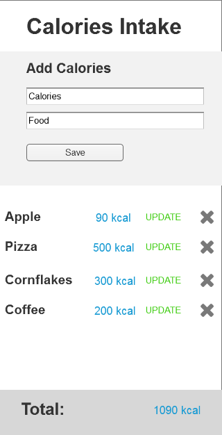
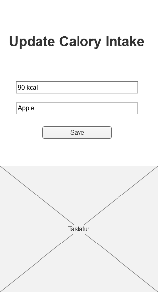

# WebDev-JS-Frameworks Finale Aufgabe: CaloryCounter

## Technische Dokumentation

### Gedankliche Aufzählung an ToDos:

* React-App
* Datenhaltung mit Datenbank auf GraphCool für Kalorien
* Komponente zum Datenmanagement - Redux, Store
* N:M Beziehung (Viele zu Viele) - Schlagworte: Kalorienkategorie, Essen
* sinnvolle Navigation zw. einzelnen Komponenten - Routing
* Smartphone- und Desktop-Implementierung (responsive)
* Authentifizierung - Email-Passwort
* Kalorien erstellen, bearbeiten und löschen, mehrere Schlagworte
* Anzeige nach Schlagwort
* Zugriff & Anzeige der Daten aus externer Datenbank

### Vorgehen:
Mit der "Create React App"-Umgebung erstellen wir eine Single-Page Applikation für die finale Abgabe im Wahlpflichtmodul Webentwicklung und JavaScript Frameworks. Wir entscheiden uns für die Umsetzung einer Anwendung zur manuellen Eingabe und Verwaltung von Kalorien, um nahe beim Thema unseres Semesterprojekts WebFit zu bleiben und ein Gefühl für die Datenhaltung mit Datenbanken zu entwickeln. Gleichzeitig haben wir das Ziel im Auge, diese bereits implementierte App bzw. Anwendung in das Projekt Webfit zu integrieren.

Im nächsten Schritt nutzen wir das Graphcool Framework, registrieren uns und setzen einen eigenen Graphcool Service auf.

Wir erhalten daraufhin die GraphQL Endpoints: 
````
Simple API:         https://api.graph.cool/simple/v1/cjippx9id2r1f017966wzguk2 
Relay API:          https://api.graph.cool/relay/v1/cjippx9id2r1f017966wzguk2
Subscriptions API:  wss://subscriptions.graph.cool/v1/cjippx9id2r1f017966wzguk2 
````

Für unsere Kalorien wird ein Data Schema für ein Query vom Typ Calory in der types.graphql Datei angelegt:
````
type Calory @model {
  id: ID! @isUnique
  foodName: String!
  calories: Int!
}
````

Nach jeder Änderung in den Dateien des Graphcool Services muss der Befehl "$graphcool deploy" ausgeführt werden.      
Änderungen an den existierenden Query Types werfen oft viele Fehler und wurden in unserem Fall nicht immer übernommen, auch bei schrittweiser Änderung nach der Graphcool-Anleitung. Am Ende war es zeitlich gesehen besser das Projekt mit neuem Graphcool Service aufzusetzen, statt stundenlang ergebnislos mit den Fehlern der Änderungen zu kämpfen. 

Wir öffnen den Playground und erstellen entsprechend Querys und Mutations zu unseren Kalorien. 

````
{
  allCalories {
    id
    foodName
    calories
  }
}

mutation {
  createCalory(
    foodName: "pizza"
    calories:	1330
  ) {
    id
  }
}
````
Nach dem Ausführen des Playbuttons erhalten wir erste Einträge in unserer Datenbank.

Anschließend haben wir uns für die Anwendung von Redux entschieden, da es bereits im Modul weitergehend behandelt wurde.      
Das Erlernen eines bisher komplett unbekannten Client-Systems wie Apollo sprengt leider den zeitlichen Rahmen und führt zu unmengen an Komplikationen, da wir die üblichen Konventionen und Erfahrungen in diesem Gebiet noch nicht besitzen. Zwar gibt es einige Tutorials zur Anwendung von React mit Apollo von denen wir Gebrauch gemacht haben. Diese führten jedoch meist zu Verwirrungen, wenn kein passendes Beispiel zur Abgabe bereitgestellt wurde und man sich erst in einen unbekannten Code einarbeiten musste, um auftretende Fehler und dessen Lösungen herleiten zu können.

Wir erstellen Action Creaters, Reducers und Components. 

````
export const fetchCalories = () => dispatch => {
  const gcEndPoint = `https://api.graph.cool/simple/v1/cjk2s6zye0f1w0154378prmx3`
  const gcQuery = `query {allCalorieses {id foodName calories}}`
  request (gcEndPoint, gcQuery)
  .then(users => {
    dispatch({
      type: FETCH_CALORIES,
      payload: users.allCalorieses
    })
  })
};
````
Dieses Beispiel stellt einen Ausschnitt von CaloryActions.js dar.          
Daten unserer Graphcool-Datenbank müssen zunächst mit Hilfe von graphql-requests gefetcht werden, um dem User Lebensmittel und deren Kalorien anzeigen zu können. Im gcEndPoint ist die API unseres GraphCool Servers gespeichert. Durch den Zugriff auf die Inhalte dieses Servers, sind sie bereit im nächsten Schritt richtig angezeigt zu werden. 

Unsere Reducers behandeln die Stateveränderungen.     
Die Components kümmern sich um die Darstellung auf der Seite und die einzelnen Aktionen. 

Die Funktionen "Eintragen", "Bearbeiten" und "Löschen" von Kalorien und Lebensmitteln wurden entsprechend in Form von einfachen Eingabeformularen implementiert.

Die sinnvolle Navigation zwischen einzelnen Komponenten übernimmt bei uns das Routing.     
Von der Hauptseite aus wird der Seitenteil unterhalb des Headers immer wieder neu gerendert.        
Auf der Haupseite ist zunächst nur der Header mit zwei Links zur Login- bzw. Registrierungsoption zu sehen. Der Header bleibt immer zu sehen und verändert sich nicht.        
Der Registrierungslink führt direkt zum Authentifizierungsformular, welches nach erfolgreicher vervollständigung widerum zum Login Bereich weiterleitet.     
Nach erfolgreichem authorisiertem Zugriff wird man zur Kalorienliste weitergeleitet. Darunter ist das Formular zum manuellen Hinzufügen einzelner Kalorien zu sehen.      
Beim Anklicken des Buttons "Eintrag Löschen" wird der untere Seitenteil erneut gerendert und der Kalorieneintrag ist nicht mehr zu sehen. Wird hingegen der "Eintrag bearbeiten"-Link betätigt, rendert der besagte Seitenteil neu und es erscheint ein Kalorienformular zum Bearbeiten, dessen Felder mit den vorherigen Kaloriendaten ausgefüllt sind. Nachdem der "Update" Button angeklickt wurde, wird der Seitenteil wieder neu gerendert und führt zurück Kalorienliste mit der Funktion zum Hinzufügen.       
Wenn der Button "Eintragen" gedrückt wird, wird ebenso der Seitenteil mit der Kalorienliste und dem Formular zum Hinzufügen erneut gerendert.


Dieser Screenshot stellt unseren Graphcool Server dar. Mit dem Type Calorie können Lebensmittel mit der jeweiligen Kalorienzahl erstellt werden. Und der Type User ermöglicht die Umsetzung der Email Authentifizierung. 
Leider ergaben sich große Probleme beim Überschreiben der Daten in der Graphcool Datenbank über die Code Implementierung. Da sich so kurz fristig keine Hilfe mehr finden lies, haben wir uns entschlossen das Projekt zu clonen und mit dem Graphcool CLI im Browser neu umzusetzen.        
Wie man erkennen kann, ist diese Seite mit der Browser Version übersichtlich, angenehmer und auch intuitiver gestaltet, als das Bedienen bzw. Aufrufen des Graphcool Servers mit Hilfe der Commandline und der Implementierung auf Code Basis (Hier mussten Commands wie graphcool deploy, graphcool playground angewendet werden). Zumal man sich kaum Gedanken um die Synchronisation machen muss.      
Leider haben wir diesen Wechsel unserer Meinung nach zu spät durchgenommen, wordurch wir in Zeitverzug gekommen sind.      

Nachdem der Hauptbestandteil der Applikation mit React und Redux umgesetzt wurde, entschieden wir uns für eine einfache E-Mail-Passwort-Authentifikation von Graphcool.       
Dafür muss zuerst die entsprechende Erweiterung der Authentifikation bei Graphcool aktiviert werden.   

Dieses einfache und praktische Plugin ist ein weiterer Faktor, weswegen wir begeistert vom Browsertool Graphcool sind. Mit diesem relativ leicht aktivierbaren Plugin kann spielerisch eine Emailauthetifizierung in die App integriert werden.       
Nach anfänglicher Begeisterung wurde uns bewusst, dass dieses Plugin mit großem Aufwand in unseren Code eingebettet werden musste und Fehlermeldungen, bzw. scheiternde Registrierungen sowie Anmeldungen mehrfach vorkamen.      
Bis dato konnten wir keine fehlerfreie Version eines Logins erstellen.   
Registrierte User werden im GraphcoolServer gespeichert. Sind Anmeldungen möglich, ist fehlerfreies Routing nicht mehr möglich. Ist das Routing fehlerfrei, kann man sich nicht mehr registrieren und neue Kalorieneinträge hinzufügen.   
Dieser kleine, aber feine Unterschied kommt durch auskommentieren bzw. entauskommentieren der Zeile window.location.assign("/home") in componentWillReceiveProps zum Tragen.
````
componentWillReceiveProps(nextProps){
    if(nextProps.userLogin){
      //window.location.assign("/home")
      //ROUTING!!
    }
````

Wir haben uns Gedanken zu den Desktop und Mobile Ansichten gemacht und gleich zu Anfang Wireframes dazu erstellt:





Leider konnten wir diese im Laufe der Programmierung nicht beibehalten und sind zu einer anderen progressiven Darstellung gelangt.    
Wir zielen auf ein einfaches, strukturiertes Design ab, das nicht zu sehr von der Funktionsweise ablenkt. Zumal die Applikation in unserem Sinne erweiterbar sein soll und nicht durch ein komplexes, vorgeschriebenes Design eingeschränkt werden soll. Die Ergänzung um neue Funktionen soll einfach und schnell gehen.      
Wir entscheiden uns für ein treffendes Hintergrundbild mit Speißewürfeln und einer Navigationsleiste im Header für den Login bzw. die Registrierung des Nutzers.      
Die Hautptbestandteile, wie der Login und die Kalorienliste, werden in Formularen mit einer ähnlichen Hintergrundfarbe zum Hintergrundbild angezeigt. Die zusätzlichen Funktionen, wie Hinzufügen, Bearbeiten und Registrieren, werden in Formularen mit der Farbe des Headers angezeigt. Die Buttons werden abgerundet dargesteltt, um eine Abstraktion von den üblichen Mustermodellen der E-Mail-Formulare zu bewirken. 

Die n:m Beziehung bzw die Schlagwörter wurden in unserem Projekt nicht umgesetzt. Während mehrmaligen Umkrempel der ReactApp oder Neuschreiben des Graphcool Servers, ist das anfangs geplant Zeitfenster für diese Basisanforderung kleiner geworden. Letztendlich ist auf Grund von fehlendem Basiswissen, wie auch zu knapper Zeit um sich dieses Wissen anzueigenen, dieser Teil der App nicht vorhanden.
Zu Beginn haben wir uns erhoffe, es in unserer App zu ermöglichen, dass ein Gericht aus mehreren Lebensmittel besteht, und ein Lebensmittel in mehreren Gerichten vorkommen kann.

Das Routing hat im localhost abgesehen von ein paar Macken stets funktioniert. Als die App bereit war gebuildet zu werden mit "npm run build" und online gestellt wurde, war ein fehlerfreies Routing nicht mehr möglich. Trotz detaillierter und langer Analyse von potentiellen Fehler und umschreiben und ausprobieren in Code, als auch exakt gleichem Vorgehen wie in den Vorlesungsfolien, konnte das Routing online nicht funktionsfähig gemacht werden.
## Nutzer Dokumentation

Ein fitnessorientierter Nutzer versucht seinen Kalorienverbrauch besser zu regeln und entscheidet sich dazu, die Kalorien seiner bisherigen Mahlzeiten an diesem Tag manuell in unserer Webapplikation fest zu halten.    
Der Nutzer ruft mit seinem Laptop oder Handy unsere Startseite auf und erblickt zunächst ein ansprechendes Hintergrunbild und eine Navigationsleiste.      
Die Person war noch nie zuvor auf unserer Seite und drückt auf den Signin Link.    
Es erscheint das Registrierungsformular mit schwarzem Hintergrund auf dem Bildschirm. Der Benutzer füllt alle Felder aus und gibt somit das Geschlecht, den Namen, die E-Mail-Adresse und das Passwort an. Nachdem der "Registrieren"-Button betätigt wurde, wird die Seite neu geladen und es erscheint das Loginformular mit lila-bläulichem Hintergrund.   
Mit den zuvor angegebenen Daten meldet sich der Nutzer nun in unserem Loginbereich an. Durch das Drücken des "Login"-Buttons wird die Kalorienliste mit vorgefertigten Beispieldaten angezeigt.    
Der Nutzer entscheidet sich dazu die Beispieleinträge in der Liste zu löschen und klickt auf den "Eintrag löschen"-Button. Daraufhin wird die Kalorienliste ohne den vorherigen Eintrag neu geladen und angezeigt.     
Da ein bereits vorgefertigter Eintrag mit beinahe dem Frühstück des Benutzers übereinstimmt, entschließt sich der Benutzer dazu den Eintrag zu bearbeiten.     
Der Link "Eintrag bearbeiten" wird angeklickt und führt zur Anzeige eines Bearbeitungsformulars mit schwarzem Hintergrund. Die Daten des ausgewählten Eintrags stehen bereits in den Feldern. Der Nutzer klickt in das Namensfeld und ergänzt die Speiße mit einem Beilagennamen. Anschließend klickt der Nutzer ins Feld der Kalorien, überschreibt die vorherige Kalorienanzahl und drückt auf den Button "Eintragen".
Die Kalorienseite wird dem Benutzer mit dem überarbeiteten Eintrag neu angezeigt.     
Jetzt fehlt nur noch ein Eintrag zum Mitagessen der Person. Der Nutzer scrollt auf der Seite der Kalorienliste weiter nach unten und erblickt das Formular mit schwarzem Hintergrund zur Erstellung eines neuen Eintrags.    
Nachdem die Felder "Name" und "Kalorien" ausgefüllt sind, betätigt der Nutzder den "Eintragen"-Button. Die Kalorienliste wird erneut geladen und mit dem neuen Eintrag dargestellt.   

## Erläuterung einer Entscheidung

### Apollo vs Redux

Im Laufe dieses Projekts stießen wir immer wieder auf größere Probleme in der Umsetzung mit Redux in Kombination mit Graphcool.    
Zunächst wollten wir die ganze Applikation mit Redux implementieren, da uns Redux am geläufigsten ist durch das WPM. Auch der Virtual Reality Workshop hat die Kenntnisse noch einmal aufgefrischt und ergänzt, was bei der Programmierung sehr geholfen hat. Die Redux Komponenten, Action Creater und Reducer zu erstellen viel uns leicht.    

Allerdings stießen wir schon bald an unsere Grenzen, da uns die Graphcool Implementierung noch neu war:   
Das Abändern von einzelnen Querys auf Code Basis funktionierte nicht wie vorhergesehen. Die Graphcool Services mussten ständig neu aufgesetzt werden, wenn die Probleme zu umfangreich waren und die Dokumentation von Graphcool war für uns Anfänger leider nicht ausreichend. Man findet schnell was man sucht. Allerdings beschrieben die Tutorials nur oberflächlich den Sachverhalt und ließen meistens die Detailerklärungen aus, die einige unserer Probleme behoben hätten.    
Diese undetailierte Dokumentation und fehlende Graphcool Tutorials für Redux waren ausschlagebend dafür, dass wir uns entschieden andere Tutorials auszuprobieren. Darunter waren auch ein paar Apollo Tutorials.    

Exemplarisch haben wir eine strukturierte und übersichtliche Apollo Instagram Apllikation nachgebaut und auf unsere Applikationsbedingungen angepasst. Obwohl das Tutorial sehr ausführlich jeden Schritt erklärte, konnten wir nicht alles im Code nachvollziehen.      

Tutorial: https://github.com/graphcool-examples/react-graphql/tree/master/quickstart-with-apollo   

Wenn wir unsere ganzen Applikations-Daten von Anfang an in die Graphcool Datenbank einbauten, gab es unmengen an Fehlermeldungen bezüglich React Imports, die sich auch nicht mit Hilfe von Google und anderen Informatikern lösen ließen.   
Ebenso erfolglos gestaltete sich das Debuggen bei der schrittweisen Abänderung und Eintragung in die Graphcool Datenbank. Es wurden Fehler ohne zielführende Fehlermeldungen ausgegeben oder es gab gar keine Fehlermeldungen und die Ausführung der Applikation wurde abgebrochen. Stundenlang wurde debuggt und versucht die einzelnen Fehler zu finden sowie zu lösen. Falls ein Fehler behoben wurde, folgten fünf Weitere. Da der Code nicht von uns selbst geschrieben war und einige Dateien leider auch nicht weitergehend erklärt wurden, entschieden wir uns nach zwei Tagen und vielen Apollo Tutorials und Anleitungen wieder zu Redux zurückzukehren.

Mit einem neuen Ansatz und einem frischen Kopf setzten wir uns wieder an die Redux-Kombination und verwendeten ab diesem Zeitpunkt den Graphcool Server in der Browser Version. Zusätzlich nutzten wir die WPM-Folien und ältere Projekte um bekannte Fehler zu beheben. Durch die Browser Version von Graphcool kamen so manche Probleme gar nicht mehr auf, wie zum Beispiel die Komplikationen beim Überschreiben der Daten in der Graphcool Datenbank beim Hinzufügen bzw. Ändern und Löschen der Kaloriendaten von der Applikation aus. 

Am Ende blieben wir unserem ersten Gedanken treu und verwendeten Redux, da wir bei Fehlern mit Redux schneller auf Lösungen stoßen und auch geübter im Ungang damit sind. Das Code-Verständnis ist für uns bei Redux am größten und der Zeitaufwand nimmt keine unvereinbaren Maße an. Zumal wir uns nicht extra neu einarbeiten müssen, wie es bei Apollo durchaus der Fall ist.


