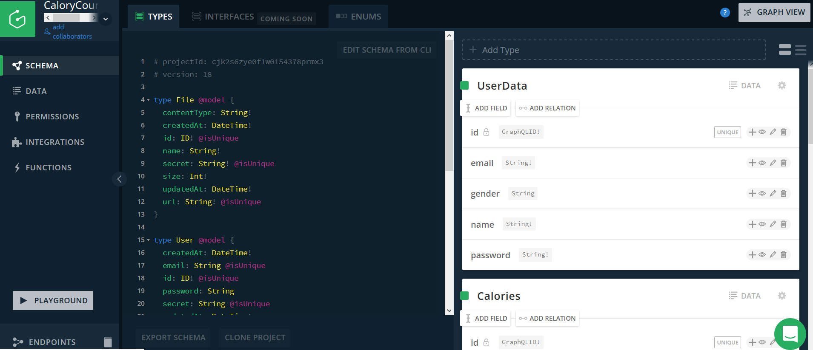
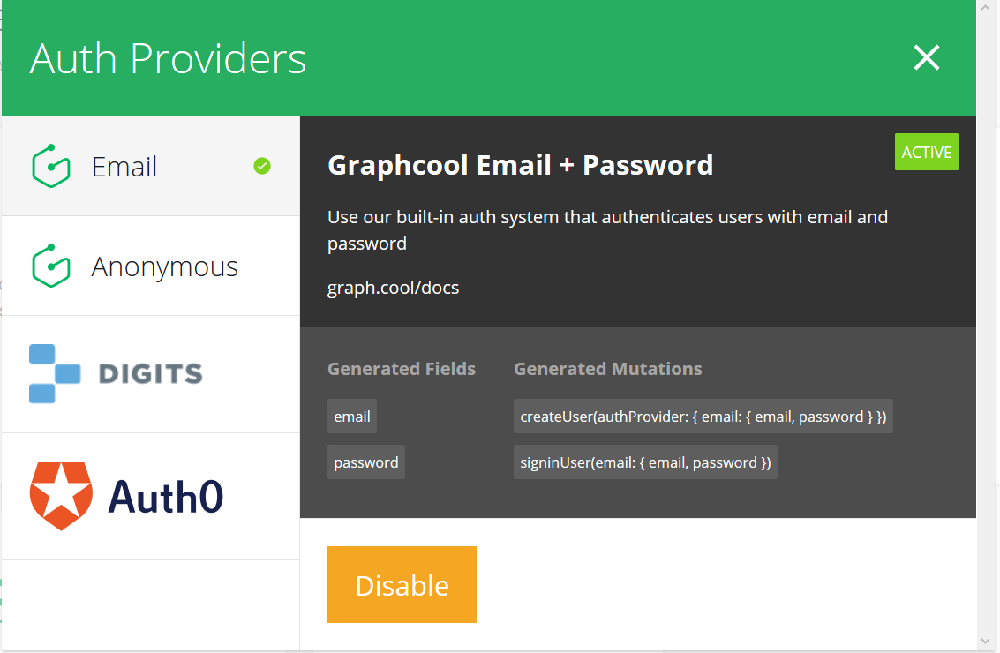

# WebDev-JS-Frameworks Finale Aufgabe: CaloryCounter

## Technische Dokumentation

### Gedankliche Aufzählung an ToDos:

* React-App
* Datenhaltung mit Datenbank auf GraphCool für Kalorien
* Komponente zum Datenmanagement - Redux, Store
* N:M Beziehung (Viele zu Viele) - Schlagworte: Kalorienkategorie, Essen
* sinnvolle Navigation zw. einzelnen Komponenten - Routing
* Smartphone- und Desktop-Implementierung (responsive)
* Authentifizierung - Email-Passwort
* Kalorien erstellen, bearbeiten und löschen, mehrere Schlagworte
* Anzeige nach Schlagwort
* Zugriff & Anzeige der Daten aus externer Datenbank

### Vorgehen:
Mit der "Create React App"-Umgebung erstellen wir eine Single-Page Applikation für die finale Abgabe im Wahlpflichtmodul Webentwicklung und JavaScript Frameworks. Wir entscheiden uns für die Umsetzung einer Anwendung zur manuellen Eingabe und Verwaltung von Kalorien, um nahe beim Thema unseres Semesterprojekts WebFit zu bleiben und ein Gefühl für die Datenhaltung mit Datenbanken zu entwickeln. Gleichzeitig haben wir das Ziel im Auge, diese bereits implementiere App bzw. Anwendung in das Projekt Webfit zu integrieren.

Im nächsten Schritt nutzen wir das Graphcool Framework, registrieren uns und setzen einen eigenen Graphcool Service auf.

Wir erhalten daraufhin die GraphQL Endpoints: 
````
Simple API:         https://api.graph.cool/simple/v1/cjippx9id2r1f017966wzguk2 
Relay API:          https://api.graph.cool/relay/v1/cjippx9id2r1f017966wzguk2
Subscriptions API:  wss://subscriptions.graph.cool/v1/cjippx9id2r1f017966wzguk2 
````

Für unsere Kalorien wird ein Data Schema für ein Query vom Typ Calory in der types.graphql Datei angelegt:
````
type Calory @model {
  id: ID! @isUnique
  foodName: String!
  calories: Int!
}
````

Nach jeder Änderung in den Dateien des Graphcool Services muss der Befehl "$graphcool deploy" ausgeführt werden.
Änderungen an den existierenden Query Types werfen oft viele Fehler und wurden in unserem Fall nicht immer übernommen, auch bei schrittweiser Änderung nach der Graphcool-Anleitung. Am Ende war es zeitlich gesehen besser das Projekt mit neuem Graphcool Service aufzusetzen, statt stundenlang ergebnislos mit den Fehlern der Änderungen zu kämpfen. 

Wir öffnen den Playground und erstellen entsprechend Querys und Mutations zu unseren Kalorien. 

````
{
  allCalories {
    id
    foodName
    calories
  }
}

mutation {
  createCalory(
    foodName: "pizza"
    calories:	1330
  ) {
    id
  }
}
````
Nach dem Ausführen des Play-buttons erhalten wir erste Einträge in unserer Datenbank.

Anschließend haben wir uns für die Anwendung von Redux entschieden, da es bereits im Modul weitergehend behandelt wurde. Das Erlernen eines bisher komplett unbekannten Client-Systems wie Apollo sprengt leider den zeitlichen Rahmen und führt zu unmengen an Komplikationen, da wir die üblichen Konventionen und Erfahrungen in diesem Gebiet noch nicht besitzen. Zwar gibt es einige Tutorials zur Anwendung von React mit Apollo von denen wir Gebrauch gemacht haben. Diese führten jedoch meist zu Verwirrungen, wenn kein passendes Beispiel zur Abgabe bereitgestellt wurde und man sich erst in einen unbekannten Code einarbeiten musste, um auftretende Fehler und dessen Lösungen herleiten zu können.

Wir erstellen Action Creaters, Reducers und Components. 
!!! ich versteh den satz nicht !!!Die Actions behandeln die Funktionen um die requests für den Zugriff auf den GraphQL Endpoint in der Datei CaloryActions.js im Ordner actions:

````
export const fetchCalories = () => dispatch => {
  const gcEndPoint = `https://api.graph.cool/simple/v1/cjk2s6zye0f1w0154378prmx3`
  const gcQuery = `query {allCalorieses {id foodName calories}}`
  request (gcEndPoint, gcQuery)
  .then(users => {
    dispatch({
      type: FETCH_CALORIES,
      payload: users.allCalorieses
    })
  })
};
````
Dieses Beispiel stellt einen Ausschnitt von CaloryActions.js dar. Daten unserer Graphcool-Datenbank müssen zunächst gefetcht werden, um dem User Lebensmittel und deren Calorien anzeigen zu können. im gcEndPoint ist die API unseres GraphCool Servers gespeichert. Auf den Inhalt dieses Servers wird zugegriffen und sind bereit im nächsten Schritt angezeigt zu werden. 

Unsere Reducers behandeln die Stateveränderungen. 
Die Components kümmern sich um die Darstellung auf der Seite und die einzelnen Aktionen. 

Funktionen Add, Update,Delete erläutern.

Die sinnvolle Navigation zwischen einzelnen Komponenten übernimmt bei uns das Routing. 
Auf der Haupseite ist zunächst nur der Header und das Authentifizierungsformular zu sehen. 
Von der Hauptseite aus wird der Seitenteil unterhalb des Headers neu gerendert und man wird zur Kalorienliste weitergeleitet. Darunter ist das Formular zum manuellen Hinzufügen einzelner Kalorien zu sehen. Der Header bleibt immer zu sehen und verändert sich nicht.
Beim Anklicken des Buttons "Delete" wird der untere Seitenteil erneut gerendert und der Kalorieneintrag ist nicht mehr zu sehen. Wird der Update-Link betätigt, rendert der besagte Seitenteil neu und es erscheint ein Kalorienformular zum Bearbeiten, dessen Felder mit den vorherigen Kaloriendaten ausgefüllt sind. Nachdem der "Update" Button angeklickt wurde, wird der Seitenteil wieder neu gerendert und führt zur Kalorienliste mit der Funktion zum Hinzufügen. 

Leider ergaben sich große Probleme beim Überschreiben der Daten in der Graphcool Datenbank über die Code Implementierung. Da sich so kurz fristig keine Hilfe mehr finden konnte, haben wir uns entschlossen das Projekt zu clonen und mit dem Graphcool CLI im Browser neu umzusetzen. Der Umgang mit Graphcool über die Browser Version ist um einiges intuitiver und angenehmer als die Implementierung auf Code Basis. Zumal man sich kaum Gedanken um die Synchronisation machen muss. 



Dieser Screenshot stellt unseren Graphcool Server dar. Wie man erkennen kann, ist diese Seiter übersichtlich und angenehmer gestaltet, als das Bedienen und Aufrufen des Graphcool Servers mit Hilfe der Commandline (Hier mussten Commands wie graphcool deploy, graphcool playground angewendet werden).
Leider haben wir diesen Wechsel unserer Meinung nach zu spät durchgenommen, wordurch wir in Zeitverzug gekommen sind.

Code files - @BEIDE

Nachdem die Hauptbestandteil der Applikation mit React und Redux umgesetzt wurde, entschieden wir uns für eine einfache E-Mail-Passwort-Authentifikation von Graphcool. 
Dafür muss zuerst die entsprechende Erweiterung der Authentifikation bei Graphcool aktiviert werden.

Dieses einfache, und praktische Plugin, ist ein weiterer Faktor, weswegen wir begeistert vom Browertool Graphcool sind. Mit diesem relativ leicht aktivierbaren Plugin kann spielerisch eine Emailauthetifizierung in die App integriert werden. 
Nach anfänglicher Begeisterung, wurde einem bewusst, dass dieses Plugin mit großem Aufwand in unseren Code eingebettet werden musste und Fehlermeldungen, bzw. scheiternde Registrierungen sowie Anmeldungen mehrfach vorkamen. 
Bis dato konnten wir keine fehlerfreie Version eines Logins erstellen.
Registrierte User werden im GraphcoolServer gespeichert. Sind Anmeldungen möglich, ist fehlerfreies Routing nicht mehr möglich. Ist das Routing fehlerfrei, kann man sich nicht mehr anmelden.
Dieser kleiner, aber feiner Unterschied wird durch kommentieren bzw. entkommentieren der Zeile window.location.assign("/home") in componentWillReceiveProps geschaltet.
````
componentWillReceiveProps(nextProps){
    if(nextProps.userLogin){
      //window.location.assign("/home")
      //ROUTING!!
    }
````

(???Verstehe ich nicht??) Danach wird ein neues Query vom Typ User mit relations zum Query vom Typ Calory erstellt sowie die actions und reducers die den User betreffen. 


Die Schlagworte sollen als vorerst einfache Lösung vordefiniert und unveränderbar sein. Ihre Verknüpfungen stellen die n:m-Beziehung zu den Kalorien dar. Umgesetzt werden die Verknüpfungen durch die Implementierung von User Input in Form von Checkboxen zu den Schlagworten und die Darstellung der Zuordnungen von Kalorien und Schlagworten in einer Liste.

Wir haben uns Gedanken zu den Desktop und Mobile Ansichten gemacht und gleich zu Anfang Wireframes dazu erstellt. Leider konnten wir diese im Laufe der Programmierung nicht beibehalten und sind zu einer anderen progressiven Darstellung gelangt. 
Wir zielen auf ein einfaches, strukturiertes Design ab, das nicht von Funktionsweise zu sehr ablenkt. Zumal die Applikation in unserem Sinne erweiterbar sein soll und nicht durch ein vorgeschriebenes Design eingeschränkt werden soll. Die Ergänzung um neue Funktionen soll einfach und schnell gehen. 


Nutzer Dokumentation

-Nutzer will manuell Kalorien einer Mahlzeit am Tag eintragen
-Nutzer landet auf HomeSeite
-Nutzer muss sich erst registrieren, kann sich beim nächsten mal direkt einloggen
-Nutzer sieht Übersicht seiner bisherigen Kalorien
-Nutzer trägt Kalorien ein, Nutzer wählt Schlagworte aus
-Nutzer lässt sich Liste der Schlagworte und Kalorien ausgeben
-Nutzer will einen kalorieneintrag ändern, da falsche Kalorienanzahl recherchiert
-Nutzer will Eintrag löschen, da falsches Essen eingetragen oder Eintrag zu alt bzw. unwichtig

Design ansprechend, intuitiv?

Entscheidungsideen: 
Apollo vs Redux (Dafür wär ich !! Weil du bereits auch Apollo probiert hast und kannst dann erwähnen was der Vorteil ist aber warum wir uns dagegen entschieden haben)

